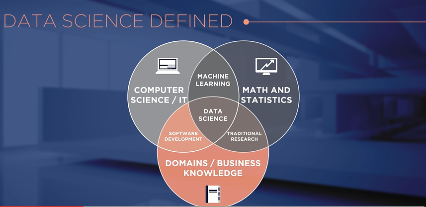
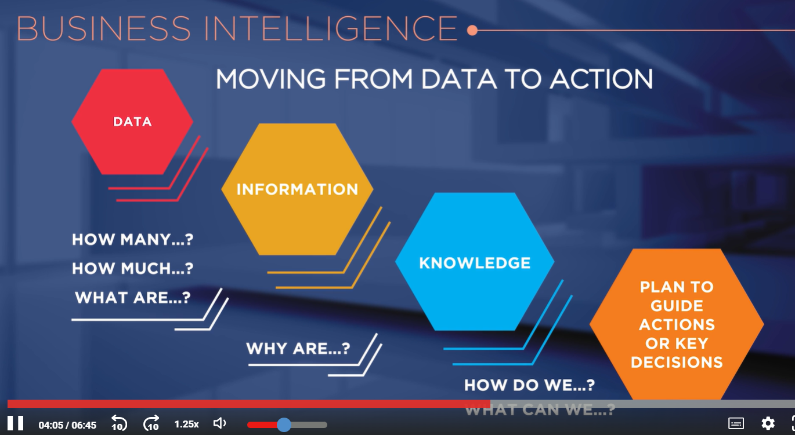
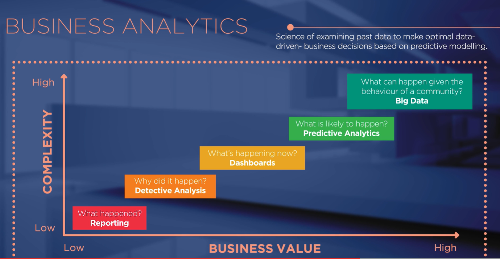
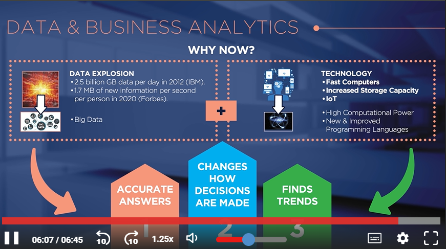

# **¿Qué es la ciencia de datos y cómo puede ayudar a obtener una ventaja competitiva?**

## **Fundamentos del data science**

> Data science is the transofrmation of data using mathematics and statistics into valuable insights, decisions and products.

> The difference between BI and Data Analytics lies in the fact that BI helps in making business decisions based on past **results** [...].

> [...] While data analytics helps in making predictions that are going to help you in the future. (Mark Van Rijmenam)

## **Why the data science sudden interest?**

## **El nuevo perfil del data scientist (lecture)**

#### **🧠 Concepto central**

- La convergencia entre análisis de localización, big data e inteligencia artificial ha generado un nuevo perfil profesional: el científico de datos.
- Su función principal: predecir, optimizar recursos y generar valor económico.

#### 🌍 **Transformación global**

- Big Data permite procesar grandes volúmenes de información y crear sistemas autónomos y autoaprendientes.
- Ejemplo: AlphaGo demuestra que las máquinas pueden superar la inteligencia humana sin intervención.
- Se requiere reformar la educación para preparar nuevos perfiles profesionales ante estos cambios disruptivos.

#### 💼 **Nuevos roles ejecutivos**

- Surge el puesto de Chief Artificial Intelligence Officer (CAIO).
  - Combina conocimientos científicos (procesos cognitivos, predicción, simulación) con visión ingenieril.
  - Aplica paradigmas simbólicos, conexionistas e híbridos.
- Refleja cómo la IA y el análisis avanzado pasan a ser parte estratégica de las organizaciones.

#### 🧩 **Aplicaciones reales**

- Policía de Vancouver (Canadá): usa machine learning y análisis geoespacial (Esri) para predecir delitos con 80 % de precisión, reduciendo el crimen en 27 %.
- Caso Nueva York: análisis edificio por edificio para detectar focos de legionela → optimización de recursos y reducción de costos.

#### 🗺️ **Geoprocesamiento y análisis espacial**

- Uso de herramientas como “spatial join” para integrar información de múltiples capas geográficas.
- Proceso estándar:
  1. Importar datos de diversas fuentes.
  2. Crear modelo multinivel.
  3. Entrenar y comparar para generar soluciones.
- Ejemplo: mapas predictivos de accidentes mediante correlación de factores humanos, naturales y climáticos.

#### 💰 **Impacto económico y profesional**

- El científico de datos se convierte en un perfil altamente demandado y bien remunerado.
- Big data demuestra alto retorno de inversión (ROI) al optimizar decisiones y acciones en tiempo real.
- Plataformas como Esri permiten aplicar el análisis geolocalizado en toda la cadena de valor: desde la captura hasta la visualización de datos.

