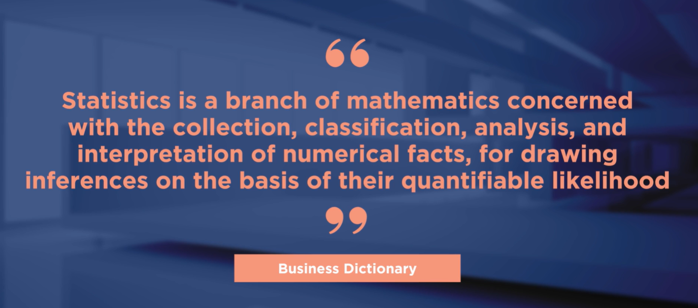
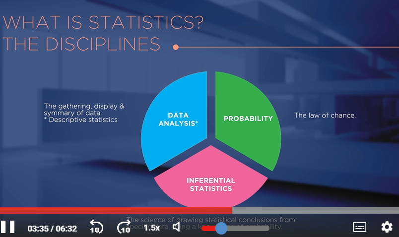

# **Introducción al Big Data**

## **Estadística: la columna vertebral del data analysis**

## **Fundamentos de los datos**

- Unidad experimental: elemento observado.
- Población: todos los elementos.
- Muestra: parte de la población.
- Variable: característica medida.
- Inferencia: conclusión sobre la población desde la - muestra.
- Datos: Estáticos o series temporales. Univariantes o multivariantes.
- Variables: dependientes/independientes, categóricas/numéricas.

## **¿Qué hace que los datos sean grandes?**

- Big Data: clave en la era digital, pero mal gestionado por muchas empresas.
- 5V: Volumen, Velocidad, Variedad, Veracidad, Valor (la más importante).
- Genera conocimiento solo si se procesa y contextualiza.
- Ejemplos: Netflix (hábitos), Starbucks (ubicaciones).
- Obstáculos: silos, mal análisis, falta de talento, estructura rígida.
- Datos deben contarse visual y humanamente: contexto, simplicidad, color, movimiento.
- No es solo para expertos: todos deben entender su valor y usarlo estratégicamente.

## **Empresas basadas en datos**

- Big Data = Intersección de estrategia y ciencia de datos → ventaja competitiva.
- Convierte datos en decisiones, eficiencia y nuevas oportunidades.
- La nube democratiza el acceso y acelera modelos de negocio.
- Analytics operacionaliza el valor: predice, prescribe, optimiza.
- Surge el Chief Data Officer para gobernar datos y valor.
- 7 principios: objetivo claro, tecnología preparada, gobernanza, cultura data-driven, nuevo consumo, medir impacto, uso diario.
- Fórmula: Tecnología + Análisis + Cambio = Optimización.
- Meta: transformar, reinventar, generar valor y nuevos ingresos.