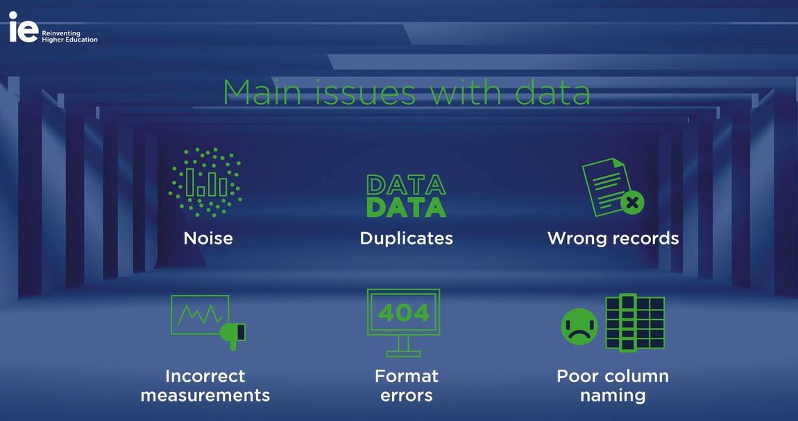
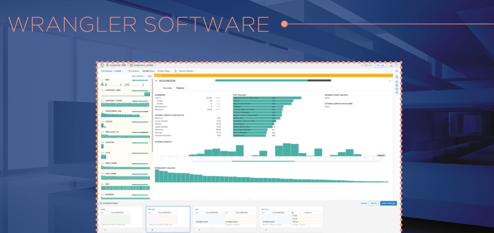
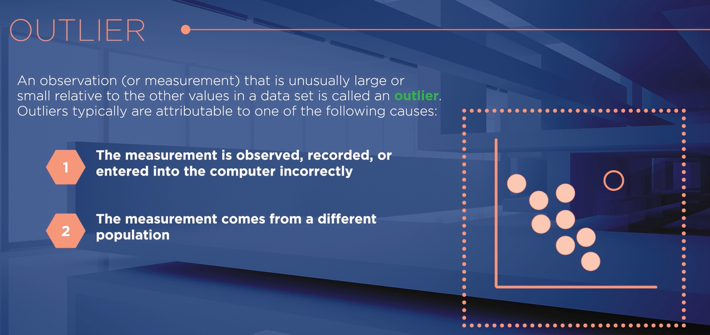

# **Data quality matters**

## **Problemas con los datos**

## **Valores perdidos y atípicos**

Formatting tool

## **El rol de los managers en la calidad de los datos**

## **Ruido, duplicados y registros erróneos**

- Calidad de datos = clave del valor en Big Data.
- Problemas comunes:
  - Ruido: info sin sentido.
  - Duplicados: registros repetidos.
  - Erróneos: datos incorrectos (no se debieron registrar).
  - Mediciones: fallas al registrar.
  - Formato: estructura inválida.
  - Nombres pobres: confunden columnas.
  - Faltantes: datos ausentes.
  - Atípicos (outliers): valores extremos.
- → Detectar y corregir = tarea esencial del científico de datos.